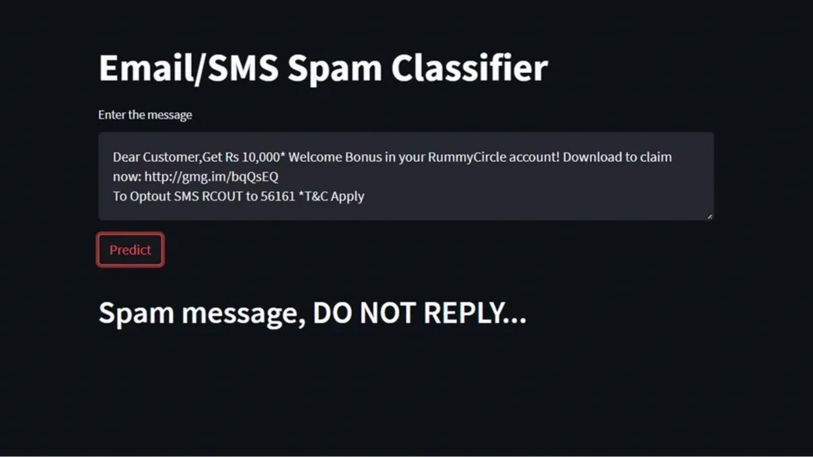

# My Portfolio Website

Welcome to my portfolio website! This is where I showcase my skills, projects, and achievements. Feel free to explore and learn more about my work.

## About Me
I'm CS prodigy adept in DBMS, Python, ML. Hackathon enthusiast with stellar academic record and meticulous data analysis skills.

## Projects
Here are some of the projects I've worked on:

- **Project 1**: Books Website with signup, login, catalog and payment page. [https://github.com/Anonymous15052003/Books_Website.git](#)

- **Project 2**: This website takes input from the user in a English PDF format and then convert that English Language into Hindi Language and returns back into the PDF format only. [https://github.com/Anonymous15052003/Langauge_Translator.git](#)

- **Project 3**: Spam Alert System.
[https://github.com/Anonymous15052003/SPAM-ALERT-SYSTEM.git](#)

---

Check out the [https://github.com/Anonymous15052003](#) repository section on my github profile for more details on each project.

## Technologies and Skills
I have experience with the following technologies and tools:

- Python
- MySQL
- HTML/CSS/JavaScript

## Contact
If you'd like to get in touch or collaborate on a project, you can reach me through the following channels:

- Email: sharon.developer07@gmail.com
- LinkedIn: https://www.linkedin.com/in/sharon-chattopadhyay/

---

Thank you for visiting my portfolio website! I hope you find it interesting and informative. Don't forget to star the repository if you like what you see!
